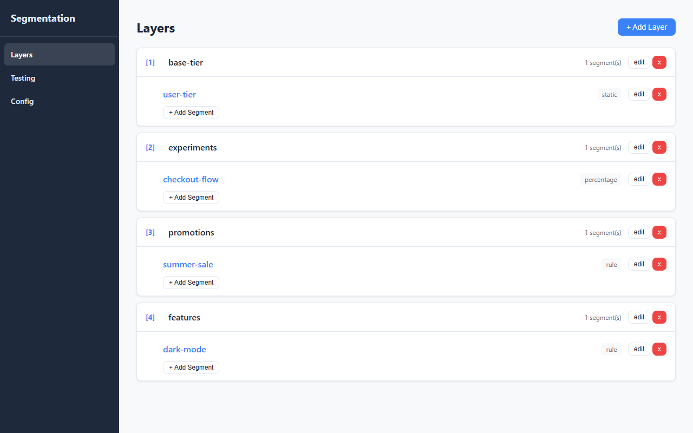
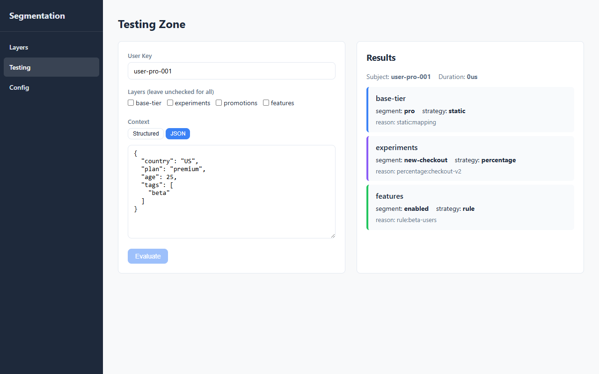
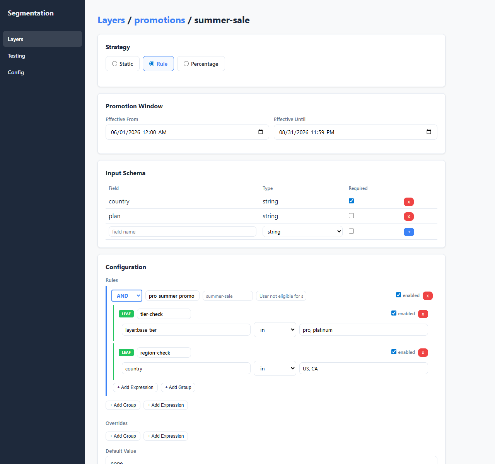
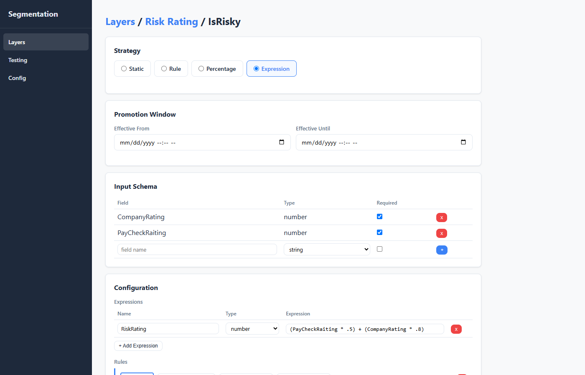
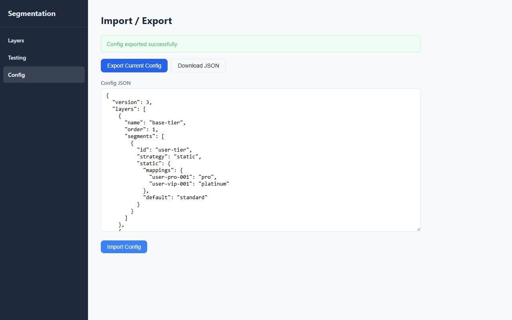

# Segmentation Microservice

A high-performance, deterministic segmentation engine built in Go. Evaluates users across multiple **layers** with support for **composite AND/OR rules** (inspired by [Microsoft Rules Engine](https://microsoft.github.io/RulesEngine/)), **time-bound promotions**, **cross-layer dependencies**, and **hot-reloading** configuration.

## Screenshots

### Layer Management
View and manage all segmentation layers with their segments, strategies, and ordering.



### Testing Zone
Evaluate users in real-time with JSON context input. Results are color-coded by strategy (blue = static, green = rule, purple = percentage).



### Segment Editor
Configure segments with strategy selection, promotion time windows, input schema validation, and composite AND/OR rule trees with cross-layer references.



### Expression Strategy
Define named computed fields using [expr-lang](https://expr-lang.org/) expressions. Computed values are merged into the evaluation context and available as rule fields, with results surfaced in the testing zone.



### Config Import/Export
Export and import full configuration snapshots as JSON for backup or environment migration.



## Key Features

- **Layered evaluation** — Independent segmentation dimensions evaluated in order (tiers, experiments, promotions, features)
- **Cross-layer dependencies** — Later layers can reference earlier results via `"field": "layer:<name>"`
- **Composite rule trees** — AND/OR rules with short-circuit evaluation, inspired by Microsoft Rules Engine
- **Four strategies** — Static (map lookup), Rule (composite tree), Percentage (FNV-1a hash bucketing), Expression (computed fields via expr-lang)
- **Expression computed fields** — Derive new values from context before rule evaluation (e.g. `abs(Rating) * -1 + Bonus`); results included in API response
- **Overrides** — Rule-based overrides evaluated before the primary strategy
- **Promotions** — Time-bound segments with `effective_from`/`effective_until`
- **Input schema validation** — Config-time validation of rule fields against declared schemas
- **Hot-reload** — File-polling watcher (500ms) with validation before swap
- **Lock-free reads** — `atomic.Pointer` for zero-contention concurrent access
- **Sub-millisecond latency** — Typical evaluation in ~25-50 microseconds

## Architecture

Domain-Driven Design with clean port/adapter boundaries:

```
cmd/segmentation/main.go          ← Composition root
internal/
  domain/                         ← Core business logic (zero dependencies)
    model/                        ← Entities & value objects
    engine/                       ← Evaluator service
    strategy/                     ← Strategy implementations
    validation/                   ← Schema validation
    ports/                        ← Interfaces (SegmentStore, Hasher, ConfigSource)
  application/                    ← Use cases (evaluate, batch, reload)
  infrastructure/                 ← Port implementations
    config/                       ← JSON file source + watcher
    store/                        ← In-memory atomic store
    hash/                         ← FNV-1a hasher
    http/                         ← HTTP handlers + middleware
```

## Getting Started

### Prerequisites

- Go 1.22+

### Run

```bash
go run ./cmd/segmentation -config config/segments.json -addr :8080
```

### Build

```bash
go build -o segmentation ./cmd/segmentation
./segmentation -config config/segments.json
```

### Docker

```bash
docker build -t segmentation .
docker run -p 8080:8080 segmentation
```

### Test

```bash
go test ./...
```

## API Reference

### POST /v1/evaluate

Evaluate a single user across all (or selected) layers.

**Request:**
```json
{
  "subject_key": "user-123",
  "context": { "country": "US", "plan": "premium", "age": 25, "tags": ["beta"] },
  "layers": ["base-tier", "promotions"]
}
```

**Response:**
```json
{
  "subject_key": "user-123",
  "layers": {
    "base-tier": { "segment": "pro", "strategy": "rule", "reason": "rule:premium-plan" },
    "promotions": { "segment": "summer-sale", "strategy": "rule", "reason": "rule:pro-summer-promo" },
    "pricing-tier": {
      "segment": "premium",
      "strategy": "expression",
      "reason": "rule:high-value",
      "expressions": {
        "AdjustedScore": 7.5,
        "IsHighValue": true
      }
    }
  },
  "warnings": [],
  "evaluated_at": "2026-07-15T12:00:00.000Z",
  "duration_us": 42
}
```

### POST /v1/evaluate/batch

Evaluate multiple users in parallel.

### GET /v1/segments

List all configured layers and segments.

### GET /v1/health

Health check. Returns `"healthy"` or `"degraded"`.

### POST /v1/reload

Force config reload from disk.

## Config Format

See `config/segments.json` for a complete example with all strategies, promotions, cross-layer references, and AND/OR rules.

### Strategies

| Strategy | Description |
|---|---|
| `static` | Direct subject key → segment mapping with default |
| `rule` | Composite AND/OR rule tree; first match wins |
| `percentage` | FNV-1a hash bucketing with weighted segments (deterministic — same subject always gets the same bucket given the same salt and weights) |
| `expression` | Evaluates named [expr-lang](https://expr-lang.org/) expressions to derive computed fields, then applies rule evaluation against the enriched context |

### Rule Structure

Rules follow a composite tree pattern:

```json
{
  "ruleName": "premium-eligible",
  "operator": "And",
  "successEvent": "premium",
  "enabled": true,
  "rules": [
    { "ruleName": "age-check", "expression": { "field": "age", "operator": "gte", "value": 18 } },
    {
      "ruleName": "region-or-spend",
      "operator": "Or",
      "rules": [
        { "ruleName": "us-user", "expression": { "field": "country", "operator": "eq", "value": "US" } },
        { "ruleName": "high-spender", "expression": { "field": "total_spend", "operator": "gte", "value": 5000 } }
      ]
    }
  ]
}
```

### Expression Strategy

The `expression` strategy computes derived fields from [expr-lang](https://expr-lang.org/) expressions before rule evaluation. Expressions are evaluated in declaration order — later expressions can reference earlier results. Computed values overwrite any `inputSchema` fields of the same name.

```json
{
  "id": "pricing-tier",
  "strategy": "expression",
  "expressions": [
    { "name": "AdjustedScore", "type": "number", "expression": "abs(Rating) * Weight" },
    { "name": "IsHighValue",   "type": "boolean", "expression": "Revenue > 10000 && AdjustedScore > 5" }
  ],
  "inputSchema": {
    "Rating":  { "type": "number", "required": true },
    "Weight":  { "type": "number", "required": true },
    "Revenue": { "type": "number", "required": false }
  },
  "rules": [
    {
      "ruleName": "high-value",
      "successEvent": "premium",
      "expression": { "field": "IsHighValue", "operator": "eq", "value": true }
    }
  ],
  "default": "standard"
}
```

**How it works:**
1. Expressions are compiled at config save time — invalid syntax is rejected immediately.
2. At evaluation time, each expression runs against the current context in order; failures are silently skipped.
3. Computed values are merged into the context (overwriting input values with the same name).
4. Rules evaluate against the enriched context exactly like the `rule` strategy.
5. Computed values are returned in the API response alongside the segment assignment.

Built-in functions include `abs`, `ceil`, `floor`, `round`, `min`, `max`, `len`, `contains`, `startsWith`, `endsWith`, and all standard arithmetic and boolean operators. See the [expr-lang docs](https://expr-lang.org/docs/language-definition) for the full reference.

### Expression Operators

`eq`, `neq`, `gt`, `gte`, `lt`, `lte`, `in`, `contains`
