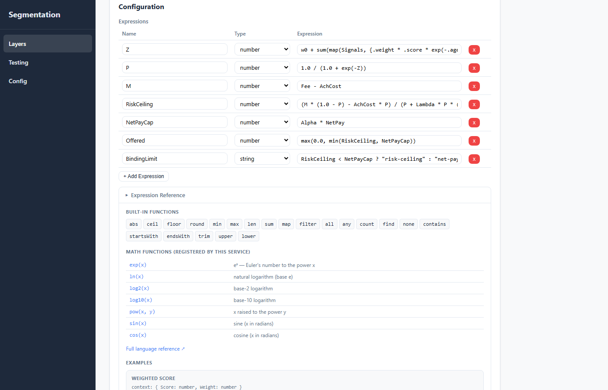
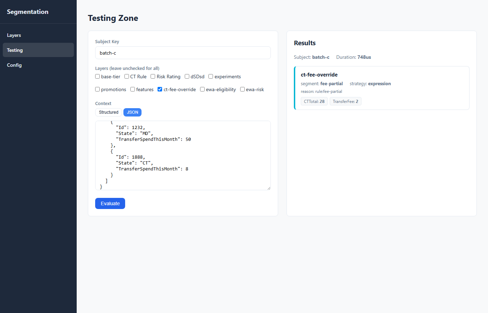
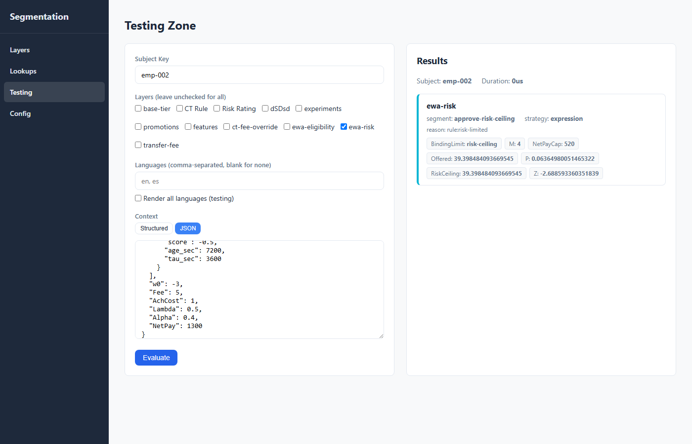

# Segmentation Microservice

A high-performance, deterministic segmentation engine built in Go. Evaluates users across multiple **layers** with support for **composite AND/OR rules** (inspired by [Microsoft Rules Engine](https://microsoft.github.io/RulesEngine/)), **time-bound promotions**, **cross-layer dependencies**, and **hot-reloading** configuration.

## Screenshots

### Layer Management
View and manage all segmentation layers with their segments, strategies, and ordering.


### Testing Zone
Evaluate users in real-time with JSON context input. Results are color-coded by strategy (blue = static, green = rule, purple = percentage).


### Segment Editor
Configure segments with strategy selection, promotion time windows, input schema validation, and composite AND/OR rule trees with cross-layer references.


### Expression Strategy
Define named computed fields using [expr-lang](https://expr-lang.org/) expressions. Computed values are merged into the evaluation context and available as rule fields, with results surfaced in the testing zone.


### Expression Reference Panel
Inline function reference — collapsible panel showing built-in functions, registered math functions (`exp`, `ln`, `pow`, etc.), and annotated examples directly in the segment editor.



### Config Import/Export
Export and import full configuration snapshots as JSON for backup or environment migration.


## Key Features

- **Layered evaluation** — Independent segmentation dimensions evaluated in order (tiers, experiments, promotions, features)
- **Cross-layer dependencies** — Later layers can reference earlier results via `"field": "layer:<name>"`
- **Composite rule trees** — AND/OR rules with short-circuit evaluation, inspired by Microsoft Rules Engine
- **Four strategies** — Static (map lookup), Rule (composite tree), Percentage (FNV-1a hash bucketing), Expression (computed fields via expr-lang)
- **Expression computed fields** — Derive new values from context before rule evaluation (e.g. `abs(Rating) * -1 + Bonus`); results included in API response
- **Overrides** — Rule-based overrides evaluated before the primary strategy
- **Lookup tables** — Centralized, named key/value tables referenced by rules via `in_lookup` / `not_in_lookup`; replaces inline value lists so shared sets are maintained in one place
- **Localized messages** — Optional message templates on rules, overrides, and defaults with `${…}` variable/expression interpolation, resolved per requested language with a layer-level fallback
- **Promotions** — Time-bound segments with `effective_from`/`effective_until`
- **Input schema validation** — Config-time validation of rule fields against declared schemas
- **Hot-reload** — File-polling watcher (500ms) with validation before swap
- **Lock-free reads** — `atomic.Pointer` for zero-contention concurrent access
- **Sub-millisecond latency** — Typical evaluation in ~25-50 microseconds

## Architecture

Domain-Driven Design with clean port/adapter boundaries:

```
cmd/segmentation/main.go          ← Composition root
internal/
  domain/                         ← Core business logic (zero dependencies)
    model/                        ← Entities & value objects
    engine/                       ← Evaluator service
    strategy/                     ← Strategy implementations
    validation/                   ← Schema validation
    ports/                        ← Interfaces (SegmentStore, Hasher, ConfigSource)
  application/                    ← Use cases (evaluate, batch, reload)
  infrastructure/                 ← Port implementations
    config/                       ← JSON file source + watcher
    store/                        ← In-memory atomic store
    hash/                         ← FNV-1a hasher
    http/                         ← HTTP handlers + middleware
```

## Getting Started

### Prerequisites

- Go 1.22+

### Run

```bash
go run ./cmd/segmentation -config config/segments.json -addr :8080
```

### Build

```bash
go build -o segmentation ./cmd/segmentation
./segmentation -config config/segments.json
```

### Docker

```bash
docker build -t segmentation .
docker run -p 8080:8080 segmentation
```

### Test

```bash
go test ./...
```

## API Reference

### POST /v1/evaluate

Evaluate a single user across all (or selected) layers.

**Request:**
```json
{
  "subject_key": "user-123",
  "context": { "country": "US", "plan": "premium", "age": 25, "tags": ["beta"] },
  "layers": ["base-tier", "promotions"]
}
```

**Response:**
```json
{
  "subject_key": "user-123",
  "layers": {
    "base-tier": { "segment": "pro", "strategy": "rule", "reason": "rule:premium-plan" },
    "promotions": { "segment": "summer-sale", "strategy": "rule", "reason": "rule:pro-summer-promo" },
    "pricing-tier": {
      "segment": "premium",
      "strategy": "expression",
      "reason": "rule:high-value",
      "expressions": {
        "AdjustedScore": 7.5,
        "IsHighValue": true
      }
    }
  },
  "warnings": [],
  "evaluated_at": "2026-07-15T12:00:00.000Z",
  "duration_us": 42
}
```

Optional request fields `languages` (array of locale codes) and `render_all` (bool) control [localized message](#localized-messages) rendering; when set, each layer result also includes a `messages` map.

### POST /v1/evaluate/batch

Evaluate multiple users in parallel.

### GET /v1/segments

List all configured layers and segments.

### GET /v1/health

Health check. Returns `"healthy"` or `"degraded"`.

### POST /v1/reload

Force config reload from disk.

## Config Format

See `config/segments.json` for a complete example with all strategies, promotions, cross-layer references, and AND/OR rules.

### Strategies

| Strategy | Description |
|---|---|
| `static` | Direct subject key → segment mapping with default |
| `rule` | Composite AND/OR rule tree; first match wins |
| `percentage` | FNV-1a hash bucketing with weighted segments (deterministic — same subject always gets the same bucket given the same salt and weights) |
| `expression` | Evaluates named [expr-lang](https://expr-lang.org/) expressions to derive computed fields, then applies rule evaluation against the enriched context |

### Rule Structure

Rules follow a composite tree pattern:

```json
{
  "ruleName": "premium-eligible",
  "operator": "And",
  "successEvent": "premium",
  "enabled": true,
  "rules": [
    { "ruleName": "age-check", "expression": { "field": "age", "operator": "gte", "value": 18 } },
    {
      "ruleName": "region-or-spend",
      "operator": "Or",
      "rules": [
        { "ruleName": "us-user", "expression": { "field": "country", "operator": "eq", "value": "US" } },
        { "ruleName": "high-spender", "expression": { "field": "total_spend", "operator": "gte", "value": 5000 } }
      ]
    }
  ]
}
```

### Rule Ordering

Evaluation is **order-sensitive — first match wins** at every level:

- **Segments** in a layer are tried top to bottom; the first one that produces an assignment wins.
- **Rules** and **overrides** within a segment are evaluated top to bottom; the first matching rule's `successEvent` becomes the result (overrides are checked before the primary strategy).
- Inside a composite rule, `And`/`Or` children short-circuit in array order.

Because order determines precedence, the segment editor UI lets you **reorder rules and overrides** with up/down controls at every nesting level, and shows a position badge plus an evaluation-order caption so the precedence is explicit.

### Localized Messages

Attach optional, localized messages to any top-level **rule**, **override**, or the segment **default** — for returning a user-facing explanation of *why* a segment was assigned (fees, eligibility, decline reasons) in the caller's language.

**Why:** keep the human-readable, translatable messaging next to the rule that produces it, and render it with live values from the evaluation context — no second lookup or downstream string-building.

**How:** a `messages` map keys each locale to a template. Templates support `${ … }` interpolation, where the contents are any [expr-lang](https://expr-lang.org/) expression evaluated against the (enriched) context — so both plain variables (`${TransferFee}`) and expressions (`${CTTotal > 30 ? 'free' : 'partial'}`) work.

```json
{
  "ruleName": "fee-partial",
  "successEvent": "fee-partial",
  "expression": { "field": "CTTotal", "operator": "gt", "value": 26 },
  "messages": {
    "en": "You'll pay a ${TransferFee} fee on your ${CTTotal} transfer.",
    "es": "Pagarás una tarifa de ${TransferFee} en tu transferencia de ${CTTotal}."
  }
}
```

- The evaluate request selects locales with `"languages": ["en", "es"]`, or `"render_all": true` to return every defined locale (a testing aid).
- If a requested locale is missing on the winning rule, it falls back to the layer's `defaultLanguage` (which defaults to `"en"`).
- Only the winning rule/override/default renders; the rendered text is returned per layer under `messages`.
- If a `${…}` expression fails, the raw token is left in place and a warning is added to the response.

**Request:**
```json
{ "subject_key": "u-1", "context": { "CTTotal": 28, "TransferFee": 2 }, "languages": ["es"] }
```

**Response (excerpt):**
```json
{
  "layers": {
    "fees": {
      "segment": "fee-partial",
      "strategy": "expression",
      "reason": "rule:fee-partial",
      "messages": { "es": "Pagarás una tarifa de 2 en tu transferencia de 28." }
    }
  }
}
```

Messages only matter on the rule that can win, so the editor is exposed on top-level rules and the default; messages on nested child rules are stripped on save.

### Lookup Tables

Centralized, named tables of typed keys that rules match against — instead of repeating the same inline value list (`in`) across many rules.

**Why:** maintain a shared set of values (zip codes, plan ids, SKUs) in one place. Rules reference a table by a **stable internal id**, so you can rename its display name or edit its entries without touching any rule.

**How:** tables live at the top level of the config under `lookups`. Each table has an immutable `id` (auto-slugged from the display `name` at creation), a `keyType` (`string` or `number`, immutable), and `entries` of `key` (the matched value) plus an optional `value` (a human-readable description of the key). Rules reference a table with the `in_lookup` / `not_in_lookup` operators, whose expression `value` is the table id. The field's type must match the table's `keyType`.

```json
{
  "lookups": [
    {
      "id": "premium-zips",
      "name": "Premium Zips",
      "keyType": "string",
      "entries": [
        { "key": "90210", "value": "Beverly Hills" },
        { "key": "10001", "value": "NYC" }
      ]
    }
  ],
  "layers": [
    {
      "name": "geo",
      "order": 1,
      "segments": [
        {
          "id": "region",
          "strategy": "rule",
          "inputSchema": { "zip": { "type": "string", "required": true } },
          "rules": [
            {
              "ruleName": "premium",
              "successEvent": "premium-region",
              "expression": { "field": "zip", "operator": "in_lookup", "value": "premium-zips" }
            }
          ],
          "default": "standard-region"
        }
      ]
    }
  ]
}
```

At evaluation the table's keys are treated exactly like an inline array — `in_lookup` means "field value is one of the keys", `not_in_lookup` is its negation.

Manage tables via the **Lookups** admin screen (or the `/v1/admin/lookups` CRUD endpoints). A table cannot be deleted while any rule references it — the API returns `409` listing the referencing rules.

### Expression Strategy

The `expression` strategy computes derived fields from [expr-lang](https://expr-lang.org/) expressions before rule evaluation. Expressions are evaluated in declaration order — later expressions can reference earlier results. Computed values overwrite any `inputSchema` fields of the same name.

```json
{
  "id": "pricing-tier",
  "strategy": "expression",
  "expressions": [
    { "name": "AdjustedScore", "type": "number", "expression": "abs(Rating) * Weight" },
    { "name": "IsHighValue",   "type": "boolean", "expression": "Revenue > 10000 && AdjustedScore > 5" }
  ],
  "inputSchema": {
    "Rating":  { "type": "number", "required": true },
    "Weight":  { "type": "number", "required": true },
    "Revenue": { "type": "number", "required": false }
  },
  "rules": [
    {
      "ruleName": "high-value",
      "successEvent": "premium",
      "expression": { "field": "IsHighValue", "operator": "eq", "value": true }
    }
  ],
  "default": "standard"
}
```

**How it works:**
1. Expressions are compiled at config save time — invalid syntax is rejected immediately.
2. At evaluation time, each expression runs against the current context in order; failures are silently skipped.
3. Computed values are merged into the context (overwriting input values with the same name).
4. Rules evaluate against the enriched context exactly like the `rule` strategy.
5. Computed values are returned in the API response alongside the segment assignment.

Built-in functions include `abs`, `ceil`, `floor`, `round`, `min`, `max`, `len`, `sum`, `map`, `filter`, `all`, `any`, `contains`, `startsWith`, `endsWith`, and all standard arithmetic and boolean operators. See the [expr-lang docs](https://expr-lang.org/docs/language-definition) for the full reference.

This service additionally registers the following math functions:

| Function | Description |
|---|---|
| `exp(x)` | eˣ — Euler's number to the power x |
| `ln(x)` | Natural logarithm (base e) |
| `log2(x)` | Base-2 logarithm |
| `log10(x)` | Base-10 logarithm |
| `pow(x, y)` | x raised to the power y |
| `sin(x)` | Sine (x in radians) |
| `cos(x)` | Cosine (x in radians) |

### Example: CT State Fee Override (Aggregated Array)

Computes the total EWA transfer spend for CT-state employees in the current batch, then determines which fee tier applies. The context contains an **array of employees** — each with their own state and spend — and the expressions aggregate across it using `filter` + `map` + `sum`.

**Fee logic (mirrors the reference Lua implementation):**
- CT total > $30 → fee waived (employees have already paid enough this month)
- CT total + $4 > $30 → partial fee (cap at $30 total; charge only the remainder)
- Otherwise → standard $4 fee

```json
{
  "id": "ct-fee",
  "strategy": "expression",
  "expressions": [
    {
      "name": "CTTotal",
      "type": "number",
      "expression": "sum(map(filter(Employees, {.State == \"CT\"}), {.TransferSpendThisMonth}))"
    },
    {
      "name": "TransferFee",
      "type": "number",
      "expression": "CTTotal > 30.0 ? 0.0 : (CTTotal + 4.0 > 30.0 ? 30.0 - CTTotal : 4.0)"
    }
  ],
  "inputSchema": {
    "Employees": { "type": "array", "required": true }
  },
  "rules": [
    {
      "ruleName": "fee-waived",
      "successEvent": "fee-waived",
      "expression": { "field": "CTTotal", "operator": "gt", "value": 30 }
    },
    {
      "ruleName": "fee-partial",
      "successEvent": "fee-partial",
      "expression": { "field": "CTTotal", "operator": "gt", "value": 26 }
    }
  ],
  "default": "fee-standard"
}
```

> **Note on nested array schemas:** `inputSchema` validates the presence and type of top-level fields. For `Employees: { type: "array" }`, the service confirms the field exists and is an array. Element-level field validation (`State`, `TransferSpendThisMonth`) is not declared in the schema — instead it is enforced by the expressions themselves. Missing or mistyped element fields cause the expression to silently return its zero value and fall through to the default segment.

Three scenarios, same config:

| Scenario | CT Employees | CTTotal | TransferFee | Segment |
|---|---|---|---|---|
| A — CT spend exceeds $30 | Id 1234 ($10) + Id 1888 ($30) | 40 | 0 | `fee-waived` |
| B — CT spend under threshold | Id 1234 ($10) + Id 1888 ($15) | 25 | 4 | `fee-standard` |
| C — CT spend will hit $30 with fee | Id 1234 ($20) + Id 1888 ($8) | 28 | 2 | `fee-partial` |

**Scenario A request:**
```json
{
  "subject_key": "batch-a",
  "context": {
    "Employees": [
      { "Id": 1234, "State": "CT", "TransferSpendThisMonth": 10 },
      { "Id": 1232, "State": "MD", "TransferSpendThisMonth": 15 },
      { "Id": 1888, "State": "CT", "TransferSpendThisMonth": 30 }
    ]
  }
}
```

**Scenario A response:**
```json
{
  "segment": "fee-waived",
  "strategy": "expression",
  "expressions": { "CTTotal": 40, "TransferFee": 0 }
}
```

**Scenario C response** (partial fee — the edge case):
```json
{
  "segment": "fee-partial",
  "strategy": "expression",
  "expressions": { "CTTotal": 28, "TransferFee": 2 }
}
```



### Example: EWA Risk Scoring (Balance Equation)

A logistic risk model for pricing and approving an earned wage advance. Age-decayed signals feed a log-odds accumulator; the resulting default probability determines the risk-adjusted maximum offer. The binding constraint (risk ceiling vs. net-pay cap) is surfaced as a segment for downstream routing.

```json
{
  "id": "ewa-risk",
  "strategy": "expression",
  "expressions": [
    {
      "name": "Z", "type": "number",
      "expression": "w0 + sum(map(Signals, {.weight * .score * exp(-.age_sec / .tau_sec)}))"
    },
    { "name": "P",              "type": "number", "expression": "1.0 / (1.0 + exp(-Z))" },
    { "name": "M",              "type": "number", "expression": "Fee - AchCost" },
    {
      "name": "RiskCeiling", "type": "number",
      "expression": "(M * (1.0 - P) - AchCost * P) / (P + Lambda * P * (1.0 - P))"
    },
    { "name": "NetPayCap",      "type": "number", "expression": "Alpha * NetPay" },
    { "name": "Offered",        "type": "number", "expression": "max(0.0, min(RiskCeiling, NetPayCap))" },
    { "name": "BindingLimit",   "type": "string", "expression": "RiskCeiling < NetPayCap ? \"risk-ceiling\" : \"net-pay-cap\"" }
  ],
  "inputSchema": {
    "Signals":  { "type": "array",  "required": true  },
    "w0":       { "type": "number", "required": true  },
    "Fee":      { "type": "number", "required": true  },
    "AchCost":  { "type": "number", "required": true  },
    "Lambda":   { "type": "number", "required": true  },
    "Alpha":    { "type": "number", "required": true  },
    "NetPay":   { "type": "number", "required": true  }
  },
  "rules": [
    {
      "ruleName": "below-minimum",
      "successEvent": "decline",
      "expression": { "field": "Offered", "operator": "lt", "value": 1 }
    },
    {
      "ruleName": "risk-limited",
      "successEvent": "approve-risk-ceiling",
      "expression": { "field": "BindingLimit", "operator": "eq", "value": "risk-ceiling" }
    }
  ],
  "default": "approve-net-pay-cap"
}
```

Request context (each signal carries its model weight, normalised score, age, and half-life — all precomputed by the calling service):

```json
{
  "Signals": [
    { "weight": 0.8,  "score": 0.3,  "age_sec": 3600,  "tau_sec": 86400 },
    { "weight": -1.2, "score": -0.5, "age_sec": 7200,  "tau_sec": 3600  }
  ],
  "w0": -3.0, "Fee": 5, "AchCost": 1, "Lambda": 0.5, "Alpha": 0.40, "NetPay": 1300
}
```

Response:
```json
{
  "segment": "approve-risk-ceiling",
  "strategy": "expression",
  "expressions": {
    "Z": -3.0, "P": 0.047, "M": 4.0,
    "RiskCeiling": 54.2, "NetPayCap": 520.0,
    "Offered": 54.2, "BindingLimit": "risk-ceiling"
  }
}
```

The `segment` carries the routing decision; `expressions` give the full numeric audit trail — `P`, `Offered`, and which limit was binding.



### Rule Operators

`eq`, `neq`, `gt`, `gte`, `lt`, `lte`, `in`, `contains`, and the lookup-table operators `in_lookup` / `not_in_lookup` (their expression `value` is a lookup table id — see [Lookup Tables](#lookup-tables)).
