# Segmentation Microservice

A high-performance, deterministic segmentation engine built in Go. Evaluates users across multiple **layers** with support for **composite AND/OR rules** (inspired by [Microsoft Rules Engine](https://microsoft.github.io/RulesEngine/)), **time-bound promotions**, **cross-layer dependencies**, and **hot-reloading** configuration.

## Screenshots

### Layer Management
View and manage all segmentation layers with their segments and strategies. Layers are listed in dependency order, with an "after &lt;layer&gt;" badge showing each declared `dependsOn` edge.

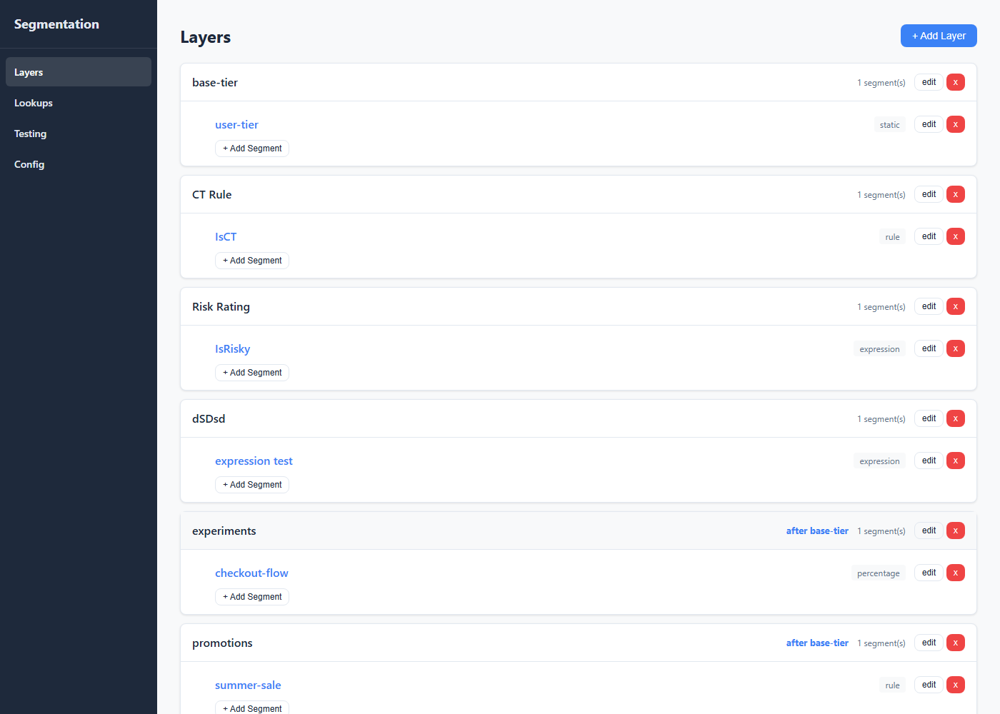

### Testing Zone
Evaluate users in real-time with JSON context input. Each layer reports its `status`, and results are color-coded by outcome.

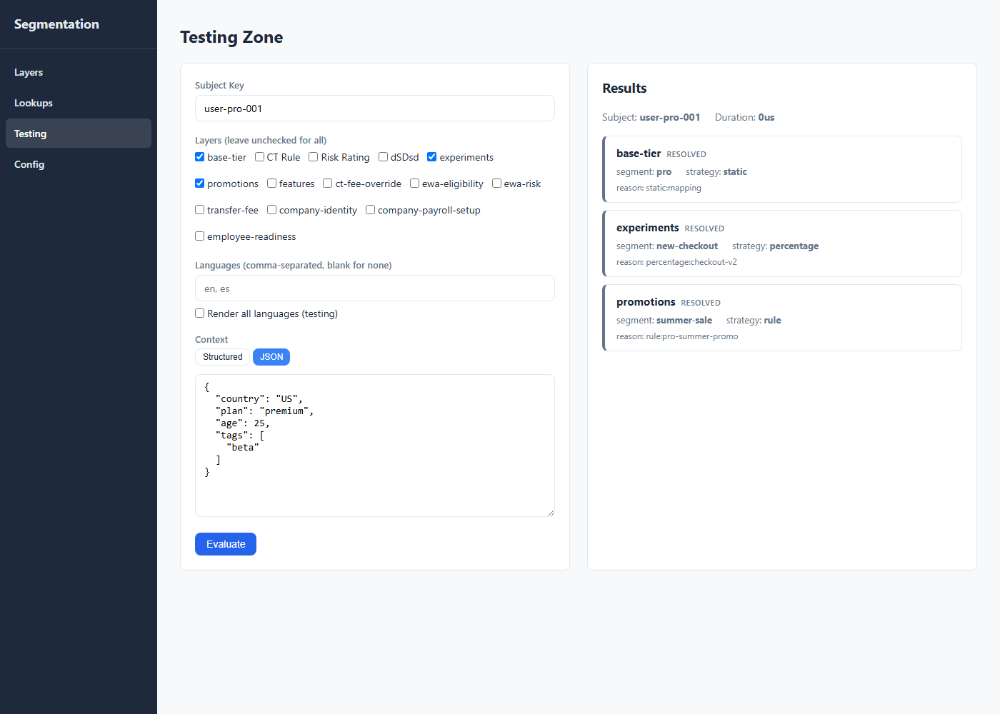

### Segment Editor
Configure segments with strategy selection, promotion time windows, input schema validation, and composite AND/OR rule trees with cross-layer references.

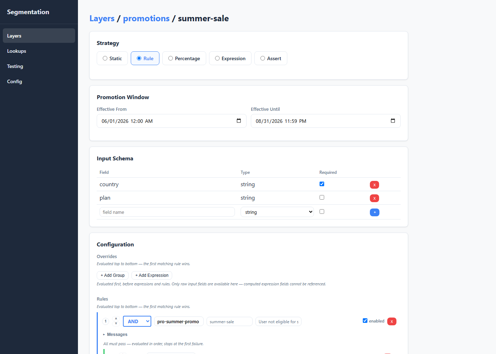

### Computed Fields
A `rule` segment may declare named values derived from [expr-lang](https://expr-lang.org/) formulas. They are merged into the evaluation context before the conditions run, available to them as ordinary fields, and returned with the result.

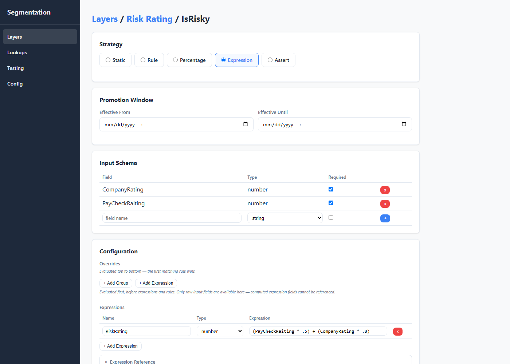

### Formula Reference
Inline function reference — collapsible panel showing built-in functions, registered math functions (`exp`, `ln`, `pow`, etc.), and annotated examples directly in the segment editor.

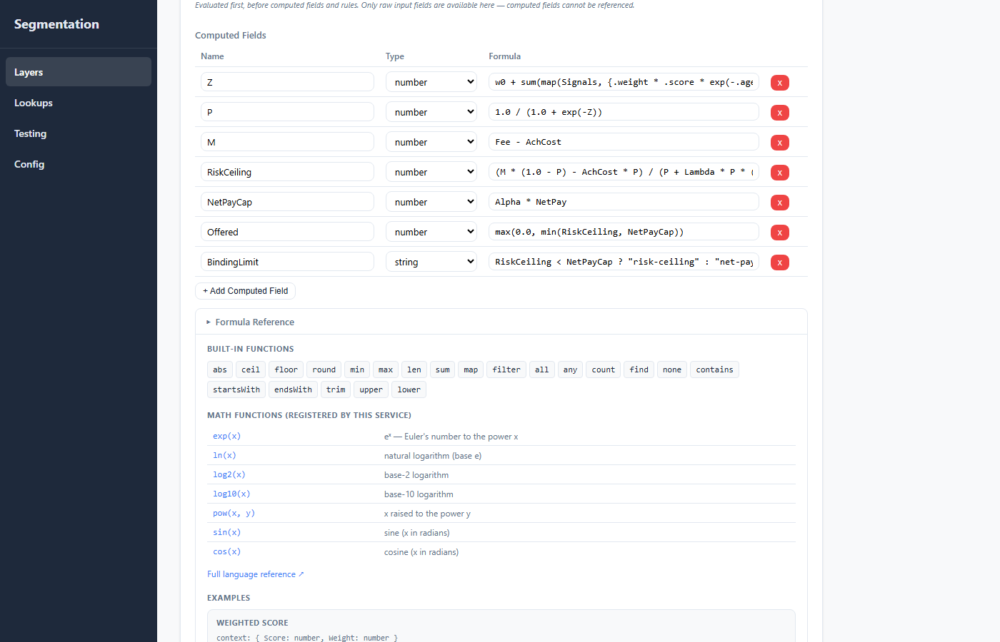

### Checklist Strategy — Progressive Validation Gates
Three gates evaluated in dependency order. `company-identity` is **satisfied**, so `company-payroll-setup` runs and itemises *all* of its problems at once. `employee-readiness` is **unevaluable** — it never ran, because the gate it depends on failed, so it reports no misleading problems of its own. See [Checklist Strategy](#checklist-strategy).

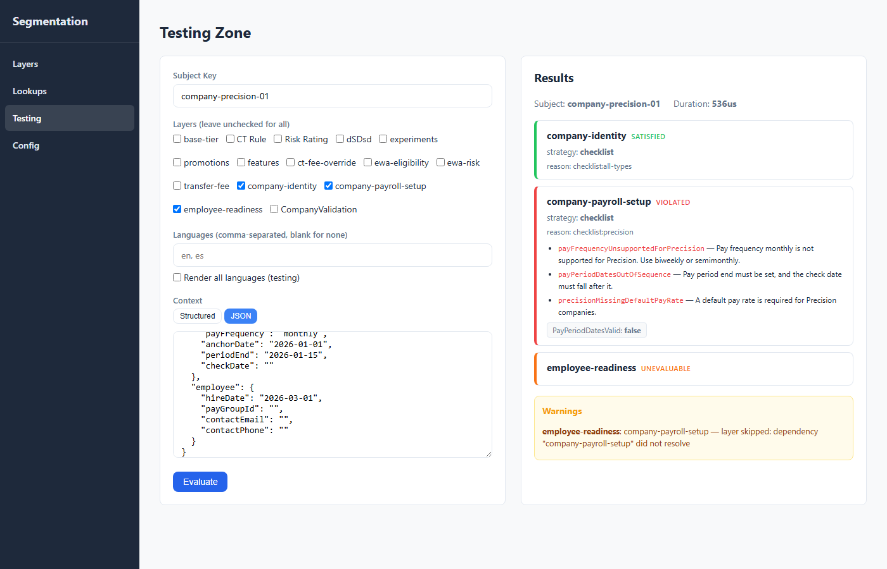

### Checklist Segment Editor
A checklist has no default and no overrides — every rule states a condition for a problem and reports its message when that condition holds.

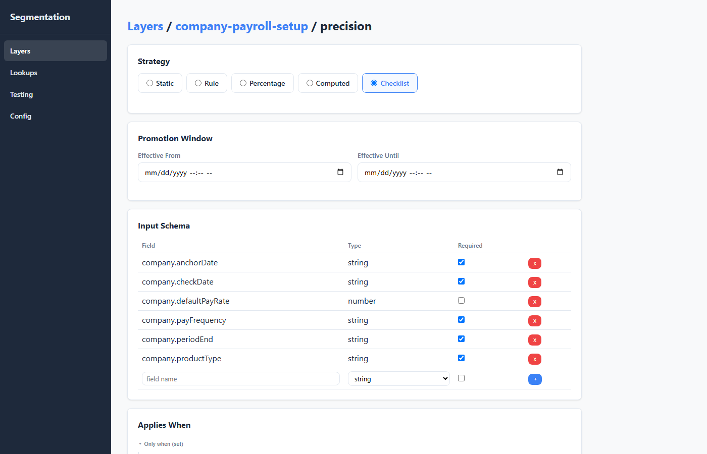

### Config Import/Export
Export and import full configuration snapshots as JSON for backup or environment migration.

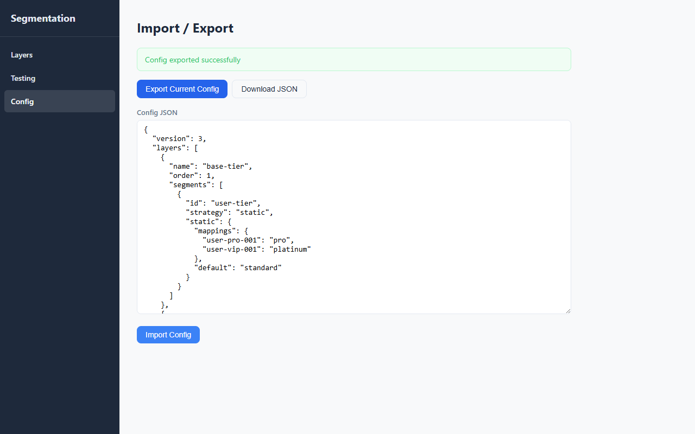

## Key Features

- **Layered evaluation** — Independent segmentation dimensions (tiers, experiments, promotions, features), executed as a dependency graph
- **Declared layer dependencies** — `dependsOn` sets execution order and gates: a layer whose dependency did not resolve is skipped rather than evaluated against missing values
- **Cross-layer dependencies** — Later layers can reference earlier results via `"field": "layer:<name>"`, validated against the declared graph
- **Composite rule trees** — AND/OR rules with short-circuit evaluation, inspired by Microsoft Rules Engine; the editor supports dragging a rule into, out of, and between groups
- **Conditional blocks** — an `Applies When` predicate on a segment gates the whole segment, so one condition governs a block of checks structurally rather than being repeated on each one
- **Four strategies** — Static (map lookup), Rule (composite tree, optionally with expr-lang computed fields), Percentage (FNV-1a hash bucketing), [Checklist](#checklist-strategy) (validation gates that itemise every problem at once)
- **Nested entity context** — Rules address a document by path (`company.payFrequency`, `employee.hireDate`), so an entity and its parent travel in one request
- **Computed fields** — Derive named values from context before rule evaluation via expr-lang formulas (e.g. `abs(Rating) * -1 + Bonus`); results included in the API response
- **Output schema** — A `rule` or `checklist` segment declares typed fields resolved into a structured record per finding via literal, template, or expr-lang values; see [Output Schema](#output-schema)
- **Overrides** — Rule-based overrides evaluated before the primary strategy
- **Lookup tables** — Centralized, named key/value tables referenced by rules via `in_lookup` / `not_in_lookup`; replaces inline value lists so shared sets are maintained in one place
- **Localized messages** — Optional message templates on rules, overrides, and defaults with `${…}` variable/formula interpolation, resolved per requested language with a layer-level fallback
- **Promotions** — Time-bound segments with `effective_from`/`effective_until`
- **Input schema validation** — Config-time validation of rule fields against declared schemas
- **Hot-reload** — File-polling watcher (500ms) with validation before swap
- **Lock-free reads** — `atomic.Pointer` for zero-contention concurrent access
- **Sub-millisecond latency** — Typical evaluation in ~25-50 microseconds

## Production readiness

**This is a proof of concept.** The engine and its evaluation semantics are the point; the
configuration store is not production infrastructure.

### What exists today

- **Store** — one JSON file. `FileSource.Save` writes to a temp file and renames, so an
  individual save is atomic, and `docker-compose` bind-mounts `./config:/config` so it
  survives a container restart. Reads are served from an in-memory `atomic.Pointer[Snapshot]`.
- **Version** — `Snapshot.Version` is a counter incremented on every save (`commitSnapshot`)
  and reported by `GET /v1/health`. It identifies the current snapshot; it is not a history.
- **Activation** — `internal/infrastructure/config/watcher.go` polls the file every 500ms,
  validates, and swaps atomically. An edit is live within half a second of being saved.

### What production needs

1. **A real datastore.** A single file has no concurrency control. `cloneSnapshot` reads the
   whole snapshot, mutates the copy, and commits with no compare-and-swap on `Version`, so two
   concurrent editors silently last-write-wins.
2. **Version history.** The counter records that something changed, not what. There is no diff,
   no previous snapshot, and no rollback short of restoring the file by hand.
3. **Change control.** No author attribution, no review or approval step, and no audit trail of
   who changed which rule.
4. **Migrations.** The config shape has already changed once — `assert` became `checklist` and
   the polarity flipped. `internal/infrastructure/config/migration_test.go` only asserts that
   the shipped config loads and validates; there is no migration machinery for configs written
   against an older shape.
5. **Staged activation.** `Rule.IsEnabled()` returns `true` when `enabled` is absent, so a newly
   authored rule goes live on save. There is no default-off gate, no environment promotion, and
   no dry-run.

Item 5 has the widest blast radius: a rule saved mid-edit is evaluated for real subjects within
500ms. Until a gate exists, treat every save to a shared config as a production deploy, and
author anything user-facing with `"enabled": false` before switching it on deliberately.
`Segment.promotion` can date-gate a whole segment, but there is no per-rule equivalent.

## Architecture

Domain-Driven Design with clean port/adapter boundaries:

```
cmd/segmentation/main.go          ← Composition root
internal/
  domain/                         ← Core business logic (zero dependencies)
    model/                        ← Entities & value objects
    engine/                       ← Evaluator service
    strategy/                     ← Strategy implementations
    validation/                   ← Schema validation
    ports/                        ← Interfaces (SegmentStore, Hasher, ConfigSource)
  application/                    ← Use cases (evaluate, batch, reload)
  infrastructure/                 ← Port implementations
    config/                       ← JSON file source + watcher
    store/                        ← In-memory atomic store
    hash/                         ← FNV-1a hasher
    http/                         ← HTTP handlers + middleware
```

## Getting Started

### Prerequisites

- Go 1.22+

### Run

```bash
go run ./cmd/segmentation -config config/segments.json -addr :8080
```

### Build

```bash
go build -o segmentation ./cmd/segmentation
./segmentation -config config/segments.json
```

### Docker

```bash
docker build -t segmentation .
docker run -p 8080:8080 segmentation
```

### Test

```bash
go test ./...
```

The rule-tree move logic behind the editor's drag and drop is pure and has its
own check (there is no JS test runner in this project):

```bash
cd ui && npm run verify:rules
```

## API Reference

### POST /v1/evaluate

Evaluate a single user across all (or selected) layers.

**Request:**
```json
{
  "subject_key": "user-123",
  "context": { "country": "US", "plan": "premium", "age": 25, "tags": ["beta"] },
  "layers": ["base-tier", "promotions"]
}
```

**Response:**
```json
{
  "subject_key": "user-123",
  "layers": {
    "base-tier": { "status": "resolved", "segment": "pro", "strategy": "rule", "reason": "rule:premium-plan" },
    "promotions": { "status": "resolved", "segment": "summer-sale", "strategy": "rule", "reason": "rule:pro-summer-promo" },
    "pricing-tier": {
      "status": "resolved",
      "segment": "premium",
      "strategy": "rule",
      "reason": "rule:high-value",
      "computed": {
        "AdjustedScore": 7.5,
        "IsHighValue": true
      }
    },
    "payroll-diagnostics": {
      "status": "violated",
      "failures": [
        {
          "rule": "advanceLimitBelowFloor",
          "message": "Advance limit is below the minimum.",
          "outputs": { "type": "limit-below-floor", "severity": { "key": "high", "value": "High severity", "order": 3 } }
        }
      ]
    }
  },
  "warnings": [],
  "evaluated_at": "2026-07-15T12:00:00.000Z",
  "duration_us": 42
}
```

Optional request fields `languages` (array of locale codes) and `render_all` (bool) control [localized message](#localized-messages) rendering; when set, each layer result also includes a `messages` map.

A segment declaring an [output schema](#output-schema) adds an `outputs` object: on the layer result for a `rule` segment's winning result, and on each item of `failures` for a `checklist`. It is only ever present when the segment declares `outputSchema` — its absence means no schema was declared, not that resolution failed silently.

Every layer result carries a `status`. It is authoritative — a consumer never needs to inspect `failures.length` to learn whether something is wrong.

| Status | Strategy | Meaning |
|---|---|---|
| `satisfied` | `checklist` | No check reported a problem |
| `violated` | `checklist` | One or more checks fired; see `failures` |
| `unevaluable` | `checklist` | Could not be judged — a dependency did not resolve, or a computed field failed at runtime |
| `resolved` | all others | Resolved to a segment |
| `unresolved` | all others | No segment produced a result |
| `skipped` | all others | A dependency did not resolve |

### POST /v1/evaluate/batch

Evaluate multiple users in parallel.

### GET /v1/segments

List all configured layers and segments.

### GET /v1/health

Health check. Returns `"healthy"` or `"degraded"`.

### POST /v1/reload

Force config reload from disk.

## Config Format

See `config/segments.json` for a complete example with all strategies, promotions, cross-layer references, and AND/OR rules.

### Strategies

| Strategy | Description |
|---|---|
| `static` | Direct subject key → segment mapping with default |
| `rule` | Composite AND/OR rule tree; first match wins. May declare [computed fields](#computed-fields) evaluated before the conditions, and an [output schema](#output-schema) resolved for the winning rule |
| `percentage` | FNV-1a hash bucketing with weighted segments (deterministic — same subject always gets the same bucket given the same salt and weights) |

| `checklist` | Validation gate. Every rule states a condition for a problem; each one that holds is itemised, with its own [output schema](#output-schema) record if one is declared. See [Checklist Strategy](#checklist-strategy) |

### Condition or computation?

Two different things used to share the name "expression", which made a rule's
test indistinguishable from an expr-lang formula in both config and code:

| Term | What it is |
|---|---|
| **`condition`** | A rule's test — `field` / `operator` / `value`. Answers *does this hold?* |
| **`computed`** | A list of named values derived before rules run. Answers *what is this value?* |
| **`formula`** | The expr-lang source of one computed field |

```json
{
  "strategy": "rule",
  "computed": [
    { "name": "MaxAllowed", "type": "number", "formula": "min(EarnedWages * 0.5, StateCap)" }
  ],
  "rules": [
    { "ruleName": "highAdvance",
      "successEvent": "premium",
      "condition": { "field": "MaxAllowed", "operator": "gte", "value": 100 } }
  ]
}
```

`computed` is a feature of `rule`, not a strategy of its own — a strategy that
computes nothing is indistinguishable from plain rule evaluation. Keeping them
separate meant declaring `computed` on a `rule` segment was silently dead
config: the formulas never ran, yet validation accepted rules referencing them.

A config still using `expression` or `expressions` fails to load, naming the
replacement — unmarshalling ignores unknown fields, so a stale key would
otherwise leave a rule with no condition, evaluating false forever.

### Rule Structure

Rules follow a composite tree pattern:

```json
{
  "ruleName": "premium-eligible",
  "operator": "And",
  "successEvent": "premium",
  "enabled": true,
  "rules": [
    { "ruleName": "age-check", "condition": { "field": "age", "operator": "gte", "value": 18 } },
    {
      "ruleName": "region-or-spend",
      "operator": "Or",
      "rules": [
        { "ruleName": "us-user", "condition": { "field": "country", "operator": "eq", "value": "US" } },
        { "ruleName": "high-spender", "condition": { "field": "total_spend", "operator": "gte", "value": 5000 } }
      ]
    }
  ]
}
```

### Rule Ordering

Evaluation is **order-sensitive — first match wins** at every level:

- **Segments** in a layer are tried top to bottom; the first one that produces an assignment wins.
- **Rules** and **overrides** within a segment are evaluated top to bottom; the first matching rule's `successEvent` becomes the result (overrides are checked before the primary strategy).
- Inside a composite rule, `And`/`Or` children short-circuit in array order.

Because order determines precedence, the segment editor UI lets you **reorder rules and overrides** with up/down controls at every nesting level, and shows a position badge plus an evaluation-order caption so the precedence is explicit.

**Restructuring the tree.** The up/down arrows only move a rule among its own siblings. To change *where a rule sits* — a check added at the top level that belongs inside a group, or one that needs moving to a different group — drag its **⠿** handle. Drop targets appear between rules at every level while you drag, including inside empty groups, and only where the move is legal (a group cannot be dropped inside itself). The arrows remain the keyboard-reachable way to reorder siblings.

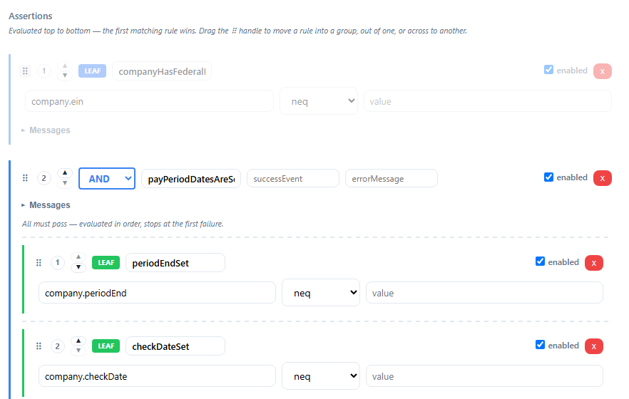

### Layer Dependencies

Layers form a dependency graph. `dependsOn` names the layers that must resolve first:

```json
{
  "name": "promotions",
  "dependsOn": ["base-tier"],
  "segments": [ … ]
}
```

It does two things:

- **Ordering** — the evaluator topologically sorts, so `layer:base-tier` is populated when `promotions` runs. Layers with no relationship have no ordering requirement.
- **Gating** — if a dependency did not resolve, this layer is **skipped** instead of evaluated against absent context. Without that, a rule reading a missing `layer:` value just evaluates false, which is indistinguishable from a real negative.

Two rules are enforced at config load:

| Rule | Why |
|---|---|
| A rule referencing `layer:x` requires `x` in `dependsOn` | A typo or a backwards reference would otherwise pass validation and evaluate false forever |
| No cycles, no self-references, no unknown names | The graph has to be executable |

Declaring a dependency that no rule references is **legal** — gating alone is a valid reason to declare an edge.

Filtering by `layers` in the request evaluates the requested layers **plus their transitive dependencies**, and nothing else.

> **Note:** `dependsOn` replaces the removed `order` field. A config still carrying `order` fails to load rather than being silently reinterpreted. To migrate, delete `order` and declare the dependencies your rules actually reference.

### Localized Messages

Attach optional, localized messages to any top-level **rule**, **override**, or the segment **default** — for returning a user-facing explanation of *why* a segment was assigned (fees, eligibility, decline reasons) in the caller's language.

**Why:** keep the human-readable, translatable messaging next to the rule that produces it, and render it with live values from the evaluation context — no second lookup or downstream string-building.

**How:** a `messages` map keys each locale to a template. Each `${ … }` token resolves in two steps, in this order: first, if the token's text names a field the layer's `inputSchema` declares, that field's value is used as-is — the context is a flat map whose keys may contain dots, so `${company.ein}` reads the single key `"company.ein"` rather than doing member access on a `company` object (which is why a *condition* on a dotted field has always worked, while a template on the same field used not to). Otherwise the token is compiled as an [expr-lang](https://expr-lang.org/) expression, so both plain variables (`${TransferFee}`) and compound expressions (`${CTTotal > 30 ? 'free' : 'partial'}`) work — a token is not merely a field reference.

Both steps are checked at config load, not left to fail at evaluation: a token that names neither a declared field nor a compilable expression is rejected, naming the layer, segment, rule and token:

```
layer "payroll" segment "p" rule "r1" errorMessage: token "${nam}": unknown name nam
```

A layer that declares no `inputSchema` skips this check entirely — with no fields declared there is nothing to check a token against, so tokens there are accepted unchecked rather than all rejected.

```json
{
  "ruleName": "fee-partial",
  "successEvent": "fee-partial",
  "condition": { "field": "CTTotal", "operator": "gt", "value": 26 },
  "messages": {
    "en": "You'll pay a ${TransferFee} fee on your ${CTTotal} transfer.",
    "es": "Pagarás una tarifa de ${TransferFee} en tu transferencia de ${CTTotal}."
  }
}
```

- The evaluate request selects locales with `"languages": ["en", "es"]`, or `"render_all": true` to return every defined locale (a testing aid).
- If a requested locale is missing on the winning rule, it falls back to the layer's `defaultLanguage` (which defaults to `"en"`).
- Only the winning rule/override/default renders; the rendered text is returned per layer under `messages`.
- If a `${…}` formula fails, the raw token is left in place and a warning is added to the response.

**Request:**
```json
{ "subject_key": "u-1", "context": { "CTTotal": 28, "TransferFee": 2 }, "languages": ["es"] }
```

**Response (excerpt):**
```json
{
  "layers": {
    "fees": {
      "segment": "fee-partial",
      "strategy": "rule",
      "reason": "rule:fee-partial",
      "messages": { "es": "Pagarás una tarifa de 2 en tu transferencia de 28." }
    }
  }
}
```

Messages only matter on the rule that can win, so the editor is exposed on top-level rules and the default; messages on nested child rules are stripped on save.

### Lookup Tables

Centralized, named tables of typed keys that rules match against — instead of repeating the same inline value list (`in`) across many rules.

**Why:** maintain a shared set of values (zip codes, plan ids, SKUs) in one place. Rules reference a table by a **stable internal id**, so you can rename its display name or edit its entries without touching any rule.

**How:** tables live at the top level of the config under `lookups`. Each table has an immutable `id` (auto-slugged from the display `name` at creation), a `keyType` (`string` or `number`, immutable), an optional `description`, and `entries` of `key` (the matched value) plus an optional `value` (a human-readable description of the key). Rules reference a table with the `in_lookup` / `not_in_lookup` operators, whose condition `value` is the table id. The field's type must match the table's `keyType`.

```json
{
  "lookups": [
    {
      "id": "premium-zips",
      "name": "Premium Zips",
      "keyType": "string",
      "entries": [
        { "key": "90210", "value": "Beverly Hills" },
        { "key": "10001", "value": "NYC" }
      ]
    }
  ],
  "layers": [
    {
      "name": "geo",
      "inputSchema": { "zip": { "type": "string", "required": true } },
      "segments": [
        {
          "id": "region",
          "strategy": "rule",
          "rules": [
            {
              "ruleName": "premium",
              "successEvent": "premium-region",
              "condition": { "field": "zip", "operator": "in_lookup", "value": "premium-zips" }
            }
          ],
          "default": "standard-region"
        }
      ]
    }
  ]
}
```

At evaluation the table's keys are treated exactly like an inline array — `in_lookup` means "field value is one of the keys", `not_in_lookup` is its negation.

Manage tables via the **Lookups** admin screen (or the `/v1/admin/lookups` CRUD endpoints). A table cannot be deleted while any rule references it — the API returns `409` listing the referencing rules.

#### Ordering

Every entry carries a persisted `order` — always written, even when it is only inferred from list position, because a relational store cannot cheaply reorder rows the way an in-memory array can. Two independent flags on the table control what that number means and whether it is visible:

| Flag | Controls |
|---|---|
| `emitOrder` | whether `order` appears in the evaluation response (see [Output Schema](#output-schema)) |
| `customOrder` | whether the numbers are hand-authored, rather than inferred from list position |

All four combinations are meaningful — a table can be ordered for admin display without emitting that order, and inferred positions can be emitted without ever being hand-authored. Keeping the flags independent avoids forcing an author to hand-number a table merely to get its order into the response.

**Gaps and duplicates are deliberately unvalidated.** Hand-authored numbers are how one ordering spans several tables: give severity the values 1, 3, 5 and diagnosis type the values 2, 4, 6, and a single sort over the union of both tables interleaves them correctly — something a declared `orderBy: [severity, type]` could never do, since it can only place one whole dimension ahead of the other. Nothing checks that ranges stay disjoint or that numbers stay unique, within a table or across a group; a collision produces a tie, which a stable sort then breaks by encounter order. `description` is where an author records the scheme they are relying on, for whoever edits the table next.

### Computed Fields

A `rule` or `checklist` segment may declare `computed` fields: named values derived from [expr-lang](https://expr-lang.org/) formulas before the conditions run. Formulas are evaluated in declaration order — a later formula can reference an earlier result. Computed values overwrite any `inputSchema` fields of the same name, and are returned with the result.

```json
{
  "name": "pricing",
  "inputSchema": {
    "Rating":  { "type": "number", "required": true },
    "Weight":  { "type": "number", "required": true },
    "Revenue": { "type": "number", "required": false }
  },
  "segments": [
    {
      "id": "pricing-tier",
      "strategy": "rule",
      "computed": [
        { "name": "AdjustedScore", "type": "number", "formula": "abs(Rating) * Weight" },
        { "name": "IsHighValue",   "type": "boolean", "formula": "Revenue > 10000 && AdjustedScore > 5" }
      ],
      "rules": [
        {
          "ruleName": "high-value",
          "successEvent": "premium",
          "condition": { "field": "IsHighValue", "operator": "eq", "value": true }
        }
      ],
      "default": "standard"
    }
  ]
}
```

**How it works:**
1. Expressions are compiled at config save time — invalid syntax is rejected immediately.
2. At evaluation time, each formula runs against the current context in order; failures are silently skipped.
3. Computed values are merged into the context (overwriting input values with the same name).
4. Rules evaluate against the enriched context exactly like the `rule` strategy.
5. Computed values are returned in the API response alongside the segment assignment.

Built-in functions include `abs`, `ceil`, `floor`, `round`, `min`, `max`, `len`, `sum`, `map`, `filter`, `all`, `any`, `contains`, `startsWith`, `endsWith`, and all standard arithmetic and boolean operators. See the [expr-lang docs](https://expr-lang.org/docs/language-definition) for the full reference.

This service additionally registers the following math functions:

| Function | Description |
|---|---|
| `exp(x)` | eˣ — Euler's number to the power x |
| `ln(x)` | Natural logarithm (base e) |
| `log2(x)` | Base-2 logarithm |
| `log10(x)` | Base-10 logarithm |
| `pow(x, y)` | x raised to the power y |
| `sin(x)` | Sine (x in radians) |
| `cos(x)` | Cosine (x in radians) |

### Output Schema

A layer may declare `outputSchema` for its `rule` and `checklist` segments: named fields resolved into a structured record on every reported result, instead of a bare rule name and message. A `checklist` finding carries its own record; a `rule` segment's winning result carries one on the layer result. Raw JSON was the only way to author one until the layer editor grew a dedicated tab for it.

**Why:** without it, a consumer reconstructs a typed object from `segment` + `reason` + `computed` (or `rule` + `message`) by hand, per finding. An output schema authors that mapping once, in config, next to the rule that produces it — the same locality argument [Localized Messages](#localized-messages) already makes for message text.

```json
{
  "name": "payroll-diagnostics",
  "outputSchema": {
    "type":      { "type": "string" },
    "severity":  { "type": "string", "lookup": "diagnosis-severity", "required": true },
    "message":   { "type": "string" },
    "shortfall": { "type": "number" }
  },
  "segments": [
    {
      "id": "payroll-diagnostics",
      "strategy": "checklist",
      "computed": [
        { "name": "MaxAllowed", "type": "number", "formula": "min(EarnedWages * 0.5, StateCap)" }
      ],
      "rules": [
        {
          "ruleName": "advanceLimitBelowFloor",
          "condition": { "field": "MaxAllowed", "operator": "lt", "value": 25 },
          "errorMessage": "Advance limit is below the minimum.",
          "outputs": {
            "type": "limit-below-floor",
            "severity": "high",
            "message": "Advance limit of ${MaxAllowed} is below the $25 minimum.",
            "shortfall": "25 - MaxAllowed"
          }
        }
      ]
    }
  ]
}
```

**Response (excerpt, `MaxAllowed` = 20):**
```json
{
  "failures": [
    {
      "rule": "advanceLimitBelowFloor",
      "message": "Advance limit is below the minimum.",
      "outputs": {
        "type": "limit-below-floor",
        "severity": { "key": "high", "value": "High severity", "order": 3 },
        "message": "Advance limit of 20 is below the $25 minimum.",
        "shortfall": 5
      }
    }
  ]
}
```

#### Eval modes

How an authored value becomes a value is derived from the field's declared `type`, not authored separately: a `string` field's value is a template (text with `${ … }` tokens); every other type's value is a single whole [expr-lang](https://expr-lang.org/) expression, emitted as whatever the expression returns. A `string` field's `${ … }` tokens resolve exactly as in [Localized Messages](#localized-messages) — declared field first, expr-lang expression otherwise — and are validated at load the same way, rejecting an unknown name with the same `layer`/`segment`/`rule`/token message.

#### Type rules

Enforced at config load, not left to fail at evaluation:

- An authored value need not look like a literal to be accepted — `{"type":"number"}` authored as `"3"` still emits the JSON number `3`, because `3` is itself a valid expression. Validation compiles the value the same way evaluation does, so a value that loads is a value that will also evaluate.
- A stale `"eval"` key (from before the mode was derived from the type) is rejected at load, naming the field and telling you to remove it.

#### Where values are authored

- **Per reporting rule**, in that rule's own `outputs` — for a value that differs per finding.
- **Once, on the segment**, in its `outputs` — for a field that does not vary, covering every rule at once.

A rule's own value wins when both are present. Only **top-level** rules carry `outputs` and report; a nested `And`/`Or` branch is part of another rule's condition, not a reporting unit of its own, so it carries no output values (see [A group is one item](#a-group-is-one-item)). An authored key the layer's `outputSchema` does not declare is rejected at load — the evaluator reads the schema, not what was authored, so an undeclared key would otherwise be silently dropped with no diagnostic at runtime.

#### `required`

The caller's contract that a field will be present in the emitted record. It is checked at two points because they answer different questions:

| | Snapshot load | Evaluation |
|---|---|---|
| Asks | did an authoring path supply a value? | did the caller actually receive one? |
| On failure | **error** — the config is rejected | **warning** — evaluation continues |

At load, a required field is satisfied if the segment's own `outputs` supplies it; failing that, every **enabled** top-level rule must supply it (disabled rules are exempt, so a work-in-progress rule cannot block an unrelated save). A segment with a `default` can only be satisfied at the segment level, since the default branch has no rule to read a value from.

Config validity cannot guarantee runtime presence — a `template` or `expression` can still fail against the actual request context, and degradation (below) drops the field regardless of `required`. The evaluation-time warning is what covers that gap.

**Two exemptions.** `static` and `percentage` segments never populate a result's outputs at all, so `outputSchema` — `required` included — has no effect on them.

#### Lookup-bound fields

Setting a field's `lookup` to a table id turns its authored value from a bare key into `{ "key": ..., "value": "..." }` in the emitted record — plus `"order"` when the table sets `emitOrder` — so a consumer can sort and display a finding without a second read of the table. The field's declared `type` must match the table's `keyType`; a mismatch is rejected at load. See [Ordering](#ordering) for how `order` itself is controlled.

#### Degradation

A field whose value fails to render or evaluate is recorded as an error, and that one field is simply omitted from the record — the finding still reports. There is no partial value: a failing template degrades the whole field, not just the unresolved token, unlike a [localized message](#localized-messages), which leaves the raw `${…}` in place. A required-field check tests presence, and a half-rendered string would still be present — so an output value is all-or-nothing, whether it is templated or evaluated as an expression.

### Checklist Strategy

#### The problem it solves

A company entity comes in several types — Express, Time and Attendance, Precision — and each type requires a different set of values to be configured correctly. Get one wrong and a downstream process fails, or the employee has a degraded experience that continues until every value is fixed.

Validating with the `rule` strategy reports the first thing that fails, which produces the **round-trip problem**:

```
Admin submits  →  "Federal EIN is required"           →  fixes it, resubmits
               →  "Pay frequency is not supported"    →  fixes it, resubmits
               →  "Anchor date is missing"            →  fixes it, resubmits
```

Three round trips for problems that were all visible on the first pass. `rule` short-circuits by design — right on the segmentation hot path, wrong here.

#### What a checklist does differently

**Each rule states the condition for a problem.** When the condition holds, the rule fires and its message is reported. A rule fires on a match here exactly as it does under first-match evaluation, so the same config never means opposite things under different strategies.

| | `rule` | `checklist` |
|---|---|---|
| A matching rule | wins, evaluation stops | is reported, evaluation continues |
| Traversal | short-circuits | every rule is evaluated |
| Output | one segment value | every problem, itemised |
| Has a default | yes | no — there is no "nothing matched" outcome |

```json
{
  "name": "company-identity",
  "inputSchema": { "company.ein": { "type": "string", "required": true } },
  "segments": [{
    "id": "all-types",
    "strategy": "checklist",
    "rules": [
      {
        "ruleName": "companyMissingFederalEIN",
        "condition": { "field": "company.ein", "operator": "is_null_or_empty" },
        "errorMessage": "Federal EIN is required before payroll can be configured."
      }
    ]
  }]
}
```

Read it as: *"is the EIN missing? then report this."* Every problem comes back at once:

```json
{
  "company-payroll-setup": {
    "status": "violated",
    "failures": [
      { "rule": "payFrequencyUnsupportedForPrecision",
        "message": "Pay frequency monthly is not supported for Precision." },
      { "rule": "payPeriodDatesOutOfSequence",
        "message": "Pay period end must be set, and the check date must fall after it." }
    ]
  }
}
```

`rule` is the stable identifier — the name doubles as the public contract, so it is enforced unique across the config and should not be renamed once anything depends on it. `message` states the problem. No field path is emitted: a rule may evaluate several fields together, so a path would be present only sometimes, which a consumer could neither predict nor explain. Map `rule` to a remediation destination in your UI instead.

> **Naming matters here.** Because a rule names a *problem*, `companyMissingFederalEIN` reads correctly and `companyHasFederalEIN` reads backwards. The rule name is what appears in the response.

#### Writing conditions

State the problem, not the requirement. Most operators have a negative form for exactly this:

| Requirement | Condition that reports it |
|---|---|
| must be set | `is_null_or_empty` (or `is_null` for non-strings) |
| must be one of a list | `not_in`, or `not_in_lookup` for a [lookup table](#lookup-tables) |
| must be positive | `lte` `0` |
| must equal a value | `neq` that value |

**A comparison does not fire on an absent field.** It has nothing to compare against, so it evaluates false. When absence is *also* a problem, say so explicitly:

```json
{
  "ruleName": "precisionMissingDefaultPayRate",
  "operator": "Or",
  "errorMessage": "A default pay rate is required for Precision companies.",
  "rules": [
    { "ruleName": "defaultPayRateAbsent",      "condition": { "field": "company.defaultPayRate", "operator": "is_null" } },
    { "ruleName": "defaultPayRateNotPositive", "condition": { "field": "company.defaultPayRate", "operator": "lte", "value": 0 } }
  ]
}
```

#### A group is one item

`And` and `Or` build **one** check's condition — they are not a reporting structure. A group reports once, with its own message, however many children it has.

"At least one contact method" is a requirement, so the condition that reports it is "all of them are missing" — an `Or` of requirements becomes an `And` of absences:

```json
{
  "ruleName": "employeeMissingAllContactMethods",
  "operator": "And",
  "errorMessage": "Provide at least one contact method: email or phone.",
  "rules": [
    { "ruleName": "contactEmailAbsent", "condition": { "field": "employee.contactEmail", "operator": "is_null_or_empty" } },
    { "ruleName": "contactPhoneAbsent", "condition": { "field": "employee.contactPhone", "operator": "is_null_or_empty" } }
  ]
}
```

To report three problems separately, write three checks — not one group of three.

#### Where a failure's message comes from

A failure always carries a `message` — it is the payload, and a failure without text is unusable. It is resolved in this order:

1. the rule's `errorMessage`, if set;
2. otherwise the rule's `messages` entry for the layer's `defaultLanguage`, then `en`, then whichever locale sorts first.

The localized `messages` **map** on a failure is separate and stays opt-in: it is populated only when the request sets `languages` or `render_all`.

```jsonc
// Rule carries only localized messages; request asks for no language.
{ "rule": "companyMissingFederalEIN", "message": "Federal EIN is required." }

// Same rule; request sets "languages": ["es"].
{ "rule": "companyMissingFederalEIN",
  "message": "Federal EIN is required.",              // still the default language
  "messages": { "es": "Se requiere el EIN federal." } }
```

`message` therefore stays stable across requests regardless of the languages asked for, which makes it safe to log and compare; `messages` is what you render to a person. Both `${…}` interpolate against the same evaluation context.

In the editor, a checklist shows a **failure message** field on every rule — leaves included, since those are the checks that usually report — and hides `successEvent`, which a checklist never resolves.

#### Progressive gates

A gate is a layer of `checklist` segments plus a `dependsOn` edge to the gate before it:

```
company-identity  →  company-payroll-setup  →  employee-readiness
   EIN, legal name       pay frequency,            hire date,
                         anchor date               pay group
```

Because `company-payroll-setup` runs only when `company-identity` is satisfied, its checks need **no defensive guards** for values identity already established, and it never re-checks them. If identity fails, the downstream gates report `unevaluable` rather than a pile of misleading problems about values nobody could evaluate yet.

Independent branches still both run, so one submission surfaces the maximum set of fixable problems.

#### Per-type checks

A check that does not apply to a type simply is not in that type's list — there is no "not applicable" state to interpret. Two levels handle this, both structural:

**Within a layer**, use `when` on a segment to dispatch on type. Segments are first-match-wins, so exactly one variant applies:

```json
{
  "name": "company-payroll-setup",
  "dependsOn": ["company-identity"],
  "segments": [
    {
      "id": "precision",
      "when": { "ruleName": "isPrecision",
                "condition": { "field": "company.productType", "operator": "eq", "value": "Precision" } },
      "strategy": "checklist",
      "rules": [ "…Precision's pay-group requirements…" ]
    },
    {
      "id": "express",
      "when": { "ruleName": "isExpress",
                "condition": { "field": "company.productType", "operator": "eq", "value": "Express" } },
      "strategy": "checklist",
      "rules": [ "…Express checks; pay-group rules simply absent…" ]
    }
  ]
}
```

**Across layers**, give each conditional group its own layer. Layers all run, so "checks for everyone" and "checks only for Precision" coexist — which segments within one layer cannot do, since only the first match applies.

That is why there is no per-rule condition: one condition governs a block by putting the block in its own segment or layer, stated once, structurally.

A segment whose `when` is false is passed over entirely. If no segment in a checklist layer applies, the layer is **satisfied** — no check ran, so nothing was found wrong. It does not report `unevaluable`, which would block readiness for every subject a conditional layer simply does not cover.

#### Computed fields

`checklist` builds on the same [computed-field](#computed-fields) evaluation, so computed fields are available to the conditions and to their messages:

```json
{
  "strategy": "checklist",
  "computed": [
    { "name": "MaxAllowed", "type": "number", "formula": "min(EarnedWages * 0.5, StateCap)" }
  ],
  "rules": [{
    "ruleName": "advanceLimitBelowFloor",
    "condition": { "field": "MaxAllowed", "operator": "lt", "value": 25 },
    "errorMessage": "Advance limit of ${MaxAllowed} is below the $25 minimum."
  }]
}
```

If a computed field fails at runtime the list reports `unevaluable` and **no** failures. Falling through would report the checks that consumed the missing value as real problems.

#### Nested entities

An entity is just a schema over the evaluation context, so an employee and its parent company travel as one document and rules address them by path:

```json
{
  "subject_key": "employee-5678",
  "context": {
    "employee": { "hireDate": "2026-03-01", "payGroupId": "PG-1" },
    "company":  { "productType": "Precision", "payFrequency": "biweekly" }
  }
}
```

"Company checks" and "employee checks" are simply layers whose rules read different subtrees. There is no separate entity model and no notion of levels.

### Layers vs Segments

A **layer** is one evaluation dimension — one question the service answers. A **segment** is one possible answer to that question.

**Use separate layers for orthogonal, independent questions.** The result of one layer should not negate whether another layer runs. Good candidates:

| Layer | Question |
|---|---|
| `base-tier` | What tier is this user? |
| `experiments` | Which A/B variant? |
| `features` | Is this feature enabled? |
| `transfer-fee` | What fee applies? |

The caller uses all of them independently. A later layer can reference an earlier result via `"field": "layer:<name>"` (e.g. `experiments` skipping platinum users), but each layer still answers its own distinct question.

**Use multiple segments within one layer for alternatives to the same question.** When one question has several possible answers and only one applies at a time, list them as segments in priority order. The evaluator iterates segments in declaration order and returns on the **first active segment** that produces a result. Promotion-gated segments are automatically skipped when their window is inactive, making the next segment the fallback.

```
transfer-fee layer
 ├── july4-promo  (promotion-gated Jul 4–31 — skipped when inactive)
 └── standard     (always active — the fallback)
```

The caller reads one layer and gets one canonical result — no merging required.

**The tell:** if your caller must look at two layer results and decide which one to use, those answers belong in one layer as priority-ordered segments.

### Example: CT State Fee Override (Aggregated Array)

Computes the total EWA transfer spend for CT-state employees in the current batch, then determines which fee tier applies. The context contains an **array of employees** — each with their own state and spend — and the formulas aggregate across it using `filter` + `map` + `sum`.

**Fee logic (mirrors the reference Lua implementation):**
- CT total > $30 → fee waived (employees have already paid enough this month)
- CT total + $4 > $30 → partial fee (cap at $30 total; charge only the remainder)
- Otherwise → standard $4 fee

<details>
<summary>Layer config JSON</summary>

```json
{
  "name": "ct-fee",
  "inputSchema": {
    "Employees": { "type": "array", "required": true }
  },
  "segments": [
    {
      "id": "ct-fee",
      "strategy": "rule",
      "computed": [
        {
          "name": "CTTotal",
          "type": "number",
          "formula": "sum(map(filter(Employees, {.State == \"CT\"}), {.TransferSpendThisMonth}))"
        },
        {
          "name": "TransferFee",
          "type": "number",
          "formula": "CTTotal > 30.0 ? 0.0 : (CTTotal + 4.0 > 30.0 ? 30.0 - CTTotal : 4.0)"
        }
      ],
      "rules": [
        {
          "ruleName": "fee-waived",
          "successEvent": "fee-waived",
          "condition": { "field": "CTTotal", "operator": "gt", "value": 30 }
        },
        {
          "ruleName": "fee-partial",
          "successEvent": "fee-partial",
          "condition": { "field": "CTTotal", "operator": "gt", "value": 26 }
        }
      ],
      "default": "fee-standard"
    }
  ]
}
```

</details>

> **Note on nested array schemas:** `inputSchema` validates the presence and type of top-level fields. For `Employees: { type: "array" }`, the service confirms the field exists and is an array. Element-level field validation (`State`, `TransferSpendThisMonth`) is not declared in the schema — instead it is enforced by the formulas themselves. Missing or mistyped element fields cause the formula to silently return its zero value and fall through to the default segment.

Three scenarios, same config:

| Scenario | CT Employees | CTTotal | TransferFee | Segment |
|---|---|---|---|---|
| A — CT spend exceeds $30 | Id 1234 ($10) + Id 1888 ($30) | 40 | 0 | `fee-waived` |
| B — CT spend under threshold | Id 1234 ($10) + Id 1888 ($15) | 25 | 4 | `fee-standard` |
| C — CT spend will hit $30 with fee | Id 1234 ($20) + Id 1888 ($8) | 28 | 2 | `fee-partial` |

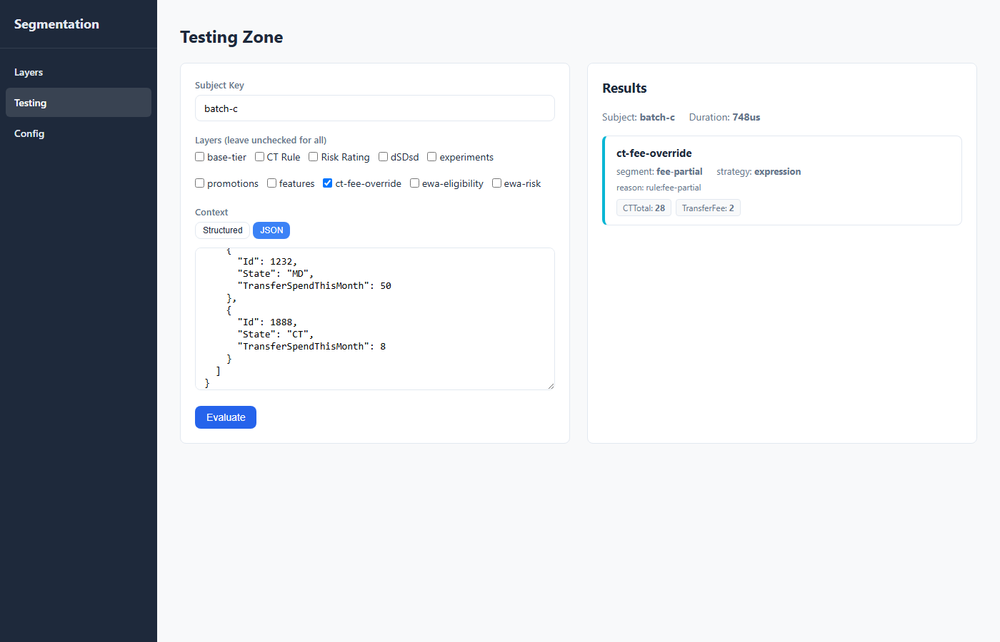

<details>
<summary>Request and response JSON (Scenarios A and C)</summary>

**Scenario A request:**
```json
{
  "subject_key": "batch-a",
  "context": {
    "Employees": [
      { "Id": 1234, "State": "CT", "TransferSpendThisMonth": 10 },
      { "Id": 1232, "State": "MD", "TransferSpendThisMonth": 15 },
      { "Id": 1888, "State": "CT", "TransferSpendThisMonth": 30 }
    ]
  }
}
```

**Scenario A response:**
```json
{
  "segment": "fee-waived",
  "strategy": "rule",
  "computed": { "CTTotal": 40, "TransferFee": 0 }
}
```

**Scenario C response** (partial fee — the edge case):
```json
{
  "segment": "fee-partial",
  "strategy": "rule",
  "computed": { "CTTotal": 28, "TransferFee": 2 }
}
```

</details>

### Example: EWA Risk Scoring (Balance Equation)

A logistic risk model for pricing and approving an earned wage advance. Age-decayed signals feed a log-odds accumulator; the resulting default probability determines the risk-adjusted maximum offer. The binding constraint (risk ceiling vs. net-pay cap) is surfaced as a segment for downstream routing.

<details>
<summary>Layer config JSON</summary>

```json
{
  "name": "ewa-risk",
  "inputSchema": {
    "Signals":  { "type": "array",  "required": true  },
    "w0":       { "type": "number", "required": true  },
    "Fee":      { "type": "number", "required": true  },
    "AchCost":  { "type": "number", "required": true  },
    "Lambda":   { "type": "number", "required": true  },
    "Alpha":    { "type": "number", "required": true  },
    "NetPay":   { "type": "number", "required": true  }
  },
  "segments": [
    {
      "id": "ewa-risk",
      "strategy": "rule",
      "computed": [
        {
          "name": "Z", "type": "number",
          "formula": "w0 + sum(map(Signals, {.weight * .score * exp(-.age_sec / .tau_sec)}))"
        },
        { "name": "P",              "type": "number", "formula": "1.0 / (1.0 + exp(-Z))" },
        { "name": "M",              "type": "number", "formula": "Fee - AchCost" },
        {
          "name": "RiskCeiling", "type": "number",
          "formula": "(M * (1.0 - P) - AchCost * P) / (P + Lambda * P * (1.0 - P))"
        },
        { "name": "NetPayCap",      "type": "number", "formula": "Alpha * NetPay" },
        { "name": "Offered",        "type": "number", "formula": "max(0.0, min(RiskCeiling, NetPayCap))" },
        { "name": "BindingLimit",   "type": "string", "formula": "RiskCeiling < NetPayCap ? \"risk-ceiling\" : \"net-pay-cap\"" }
      ],
      "rules": [
        {
          "ruleName": "below-minimum",
          "successEvent": "decline",
          "condition": { "field": "Offered", "operator": "lt", "value": 1 }
        },
        {
          "ruleName": "risk-limited",
          "successEvent": "approve-risk-ceiling",
          "condition": { "field": "BindingLimit", "operator": "eq", "value": "risk-ceiling" }
        }
      ],
      "default": "approve-net-pay-cap"
    }
  ]
}
```

</details>

The `segment` carries the routing decision; `computed` gives the full numeric audit trail — `P`, `Offered`, and which limit was binding.

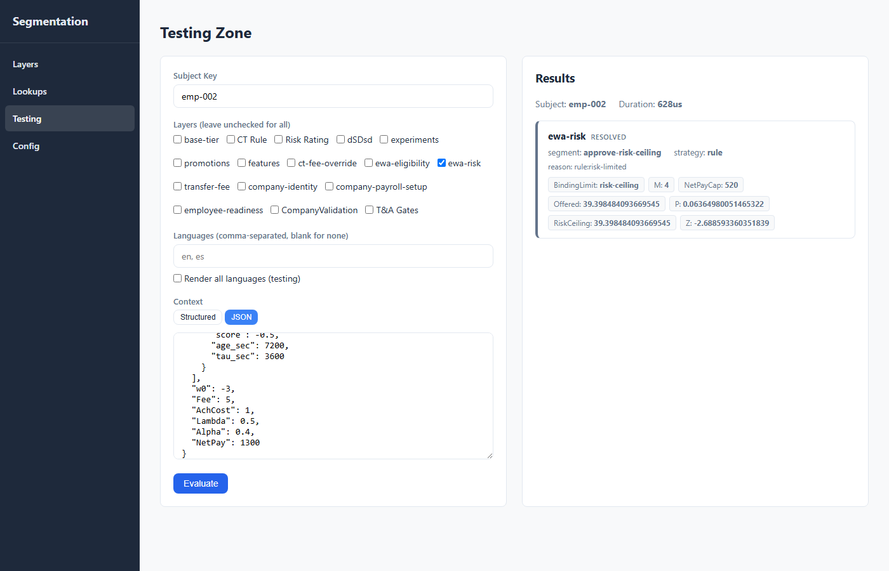

<details>
<summary>Request and response JSON</summary>

Request context (each signal carries its model weight, normalised score, age, and half-life — all precomputed by the calling service):

```json
{
  "Signals": [
    { "weight": 0.8,  "score": 0.3,  "age_sec": 3600,  "tau_sec": 86400 },
    { "weight": -1.2, "score": -0.5, "age_sec": 7200,  "tau_sec": 3600  }
  ],
  "w0": -3.0, "Fee": 5, "AchCost": 1, "Lambda": 0.5, "Alpha": 0.40, "NetPay": 1300
}
```

Response:
```json
{
  "segment": "approve-risk-ceiling",
  "strategy": "rule",
  "computed": {
    "Z": -3.0, "P": 0.047, "M": 4.0,
    "RiskCeiling": 54.2, "NetPayCap": 520.0,
    "Offered": 54.2, "BindingLimit": "risk-ceiling"
  }
}
```

</details>

### Example: Priority-Ordered Segments with Time-Bounded Promotion

The `transfer-fee` layer has two segments in priority order: the promotional rate (`july4-promo`) listed first, the standard rate as the fallback. The evaluator returns on the first active segment — `july4-promo` is skipped automatically outside its window, and `standard` takes over with no config change.

The caller always reads one layer and one canonical `Fee` value.

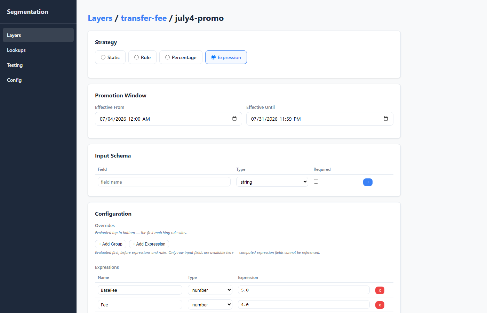

The segment editor shows: strategy = Expression, promotion window = Jul 4–31 2026, and two computed fields (`BaseFee = 5.0`, `Fee = 4.0`). The `standard` segment below it has no promotion window and `Fee = 5.0`.

<details>
<summary>Full layer config JSON</summary>

```json
{
  "name": "transfer-fee",
  "defaultLanguage": "en",
  "segments": [
    {
      "id": "july4-promo",
      "strategy": "rule",
      "computed": [
        { "name": "BaseFee", "type": "number", "formula": "5.0" },
        { "name": "Fee",     "type": "number", "formula": "4.0" }
      ],
      "default": "july4-promo",
      "promotion": {
        "effective_from": "2026-07-04T00:00:00Z",
        "effective_until": "2026-07-31T23:59:59Z"
      },
      "defaultMessages": {
        "en": "Happy 4th of July! Your transfer fee has been reduced from $${BaseFee} to $${Fee}.",
        "es": "¡Feliz 4 de Julio! Su tarifa de transferencia se ha reducido de $${BaseFee} a $${Fee}."
      }
    },
    {
      "id": "standard",
      "strategy": "rule",
      "computed": [
        { "name": "Fee", "type": "number", "formula": "5.0" }
      ],
      "default": "standard",
      "defaultMessages": {
        "en": "Your standard transfer fee is $${Fee}.",
        "es": "Su tarifa de transferencia estándar es $${Fee}."
      }
    }
  ]
}
```

`$${Fee}` renders as `$4` or `$5` — the leading `$` is a literal character; `${Fee}` is an expr-lang interpolation. `BaseFee` is kept in the promotional segment so messages can name both the original and discounted rate.

</details>

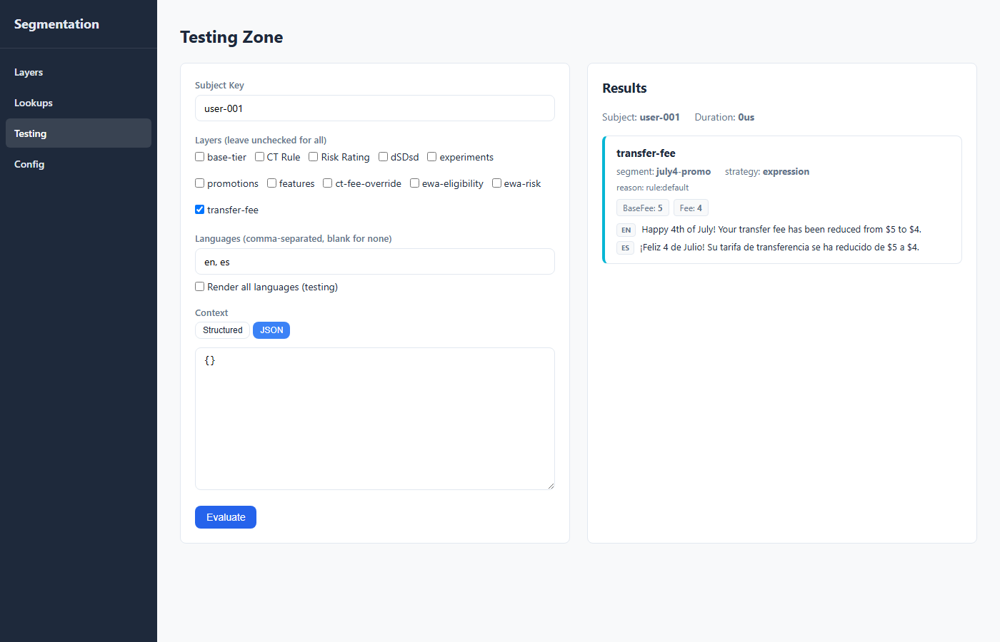

<details>
<summary>Request and response JSON (both states)</summary>

No external context is needed — both segments use constant formulas. Pass `languages` to receive rendered messages.

```json
POST /v1/evaluate
{
  "subject_key": "user-001",
  "languages": ["en", "es"]
}
```

**During promotion window (Jul 4–31):** `july4-promo` segment wins; `standard` is never evaluated.

```json
{
  "layers": {
    "transfer-fee": {
      "segment": "july4-promo",
      "strategy": "rule",
      "reason": "default",
      "computed": { "BaseFee": 5, "Fee": 4 },
      "messages": {
        "en": "Happy 4th of July! Your transfer fee has been reduced from $5 to $4.",
        "es": "¡Feliz 4 de Julio! Su tarifa de transferencia se ha reducido de $5 a $4."
      }
    }
  }
}
```

**Outside promotion window:** `july4-promo` is skipped; `standard` wins automatically.

```json
{
  "layers": {
    "transfer-fee": {
      "segment": "standard",
      "strategy": "rule",
      "reason": "default",
      "computed": { "Fee": 5 },
      "messages": {
        "en": "Your standard transfer fee is $5.",
        "es": "Su tarifa de transferencia estándar es $5."
      }
    }
  }
}
```

</details>

### Rule Operators

| Operator | Field types | Notes |
|---|---|---|
| `eq`, `neq` | string, number, boolean | |
| `gt`, `gte`, `lt`, `lte` | number | |
| `in`, `not_in` | string, number | `value` is a list |
| `contains` | array, string | substring, or array membership |
| `in_lookup`, `not_in_lookup` | string, number | `value` is a lookup table id — see [Lookup Tables](#lookup-tables) |
| `is_null` | string, number, boolean, array | takes **no** `value` |
| `is_null_or_empty` | string | takes **no** `value` |

#### Presence operators

`is_null` and `is_null_or_empty` are unary — they test the field itself, so the
expression carries no `value`:

```json
{ "field": "company.defaultPayRate", "operator": "is_null" }
```

They are also the **only** operators that hold for a field missing from the
context. Every other operator has nothing to compare an absent field against and
evaluates false. That distinction is deliberate:

| Field state | `is_null` | `is_null_or_empty` | `neq ""` |
|---|---|---|---|
| absent from context | ✅ | ✅ | ❌ |
| `null` | ✅ | ✅ | ❌ |
| `""` | ❌ | ✅ | ❌ |
| `"biweekly"` | ❌ | ❌ | ✅ |
| `0` / `false` | ❌ | ❌ | ✅ |

Under a [checklist](#checklist-strategy), where a rule states the condition for a
problem, these are the natural way to say *"this is not set"*:

```json
{ "ruleName": "contactEmailMissing",
  "condition": { "field": "employee.contactEmail", "operator": "is_null_or_empty" },
  "errorMessage": "A contact email is required." }
```

Two things to note. `is_null_or_empty` means the empty string exactly — whitespace
is not trimmed, and `0` or `false` are values, not emptiness. And `is_null` is
type-agnostic because any optional field of any type can be null, whereas
`is_null_or_empty` is a string test.
